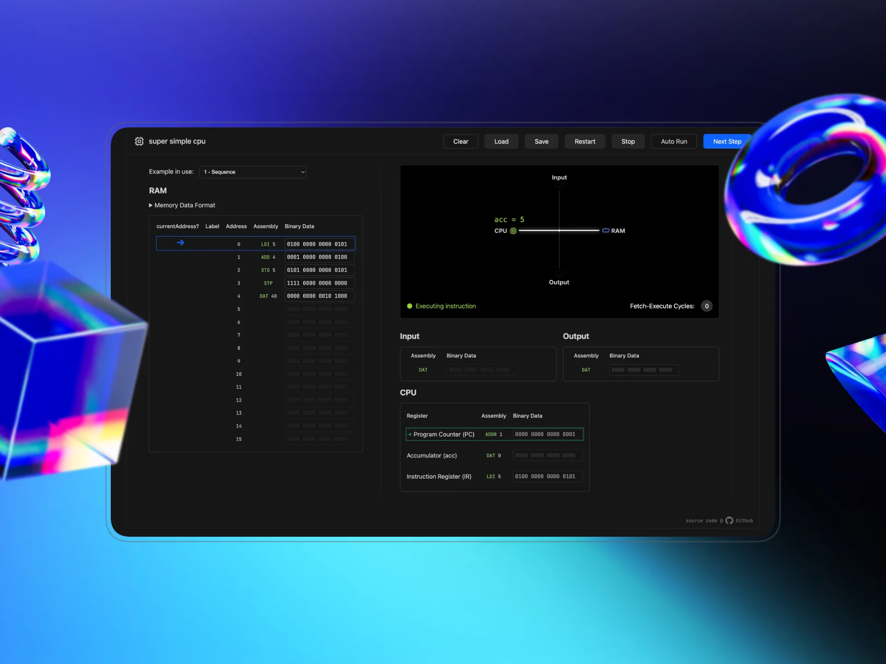

# Super Simple CPU

> A visual CPU simulator designed to visualise the Von Neumann architecture.

## Overview

_Super Simple CPU_ is an interactive, browser-based educational tool that demonstrates the Fetch-Decode-Execute cycle. 

It features an assembler, a visual bus diagram, and real-time register tracking.

Built with **vanilla JS** and **SVG** animations.[^1]

[^1]: For this project, no frameworks or libraries were allowed. All functions and code are bespoke.

## Instruction Set

The CPU uses a custom 16-bit instruction set with a 4-bit opcode and 12-bit operand.

The leading 4 bits are reserved for the opcode, and the remaining 12 bits are for the operand.

| Opcode | Mnemonic | Description |
| :--- | :--- | :--- |
| `0001` | `ADD` | Add value at memory address to the Accumulator |
| `0010` | `SUB` | Subtract value at memory address from the Accumulator |
| `0011` | `LOD` | Load value at memory address into the Accumulator |
| `0100` | `LDI` | Load immediate operand value into the Accumulator |
| `0101` | `STO` | Store the Accumulator value into memory address |
| `0110` | `INP` | Read Input to the Accumulator (overwrites current value) |
| `0111` | `OUT` | Write the Accumulator value to Output |
| `1000` | `JMP` | Jump to address |
| `1001` | `JNG` | Jump to address if Accumulator < 0 |
| `1010` | `JZR` | Jump to address if Accumulator == 0 |
| `1111` | `STP` | Halt the computer|
